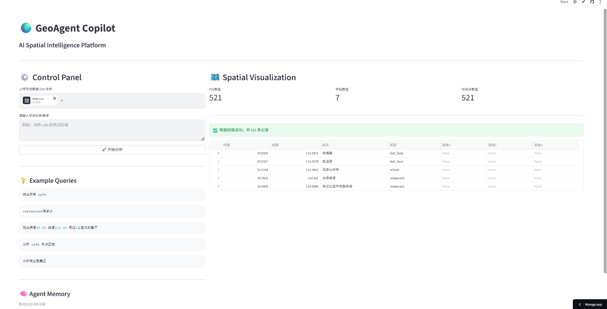
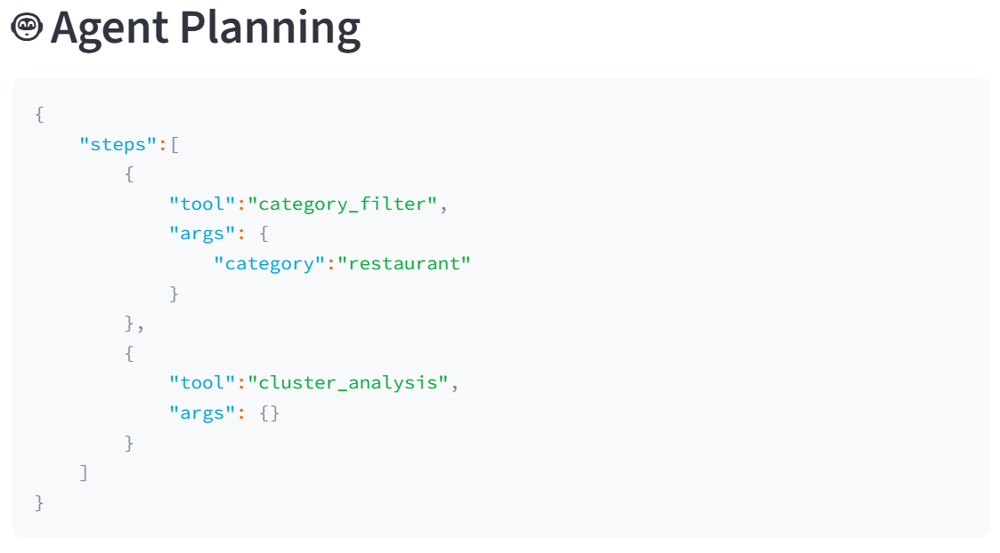
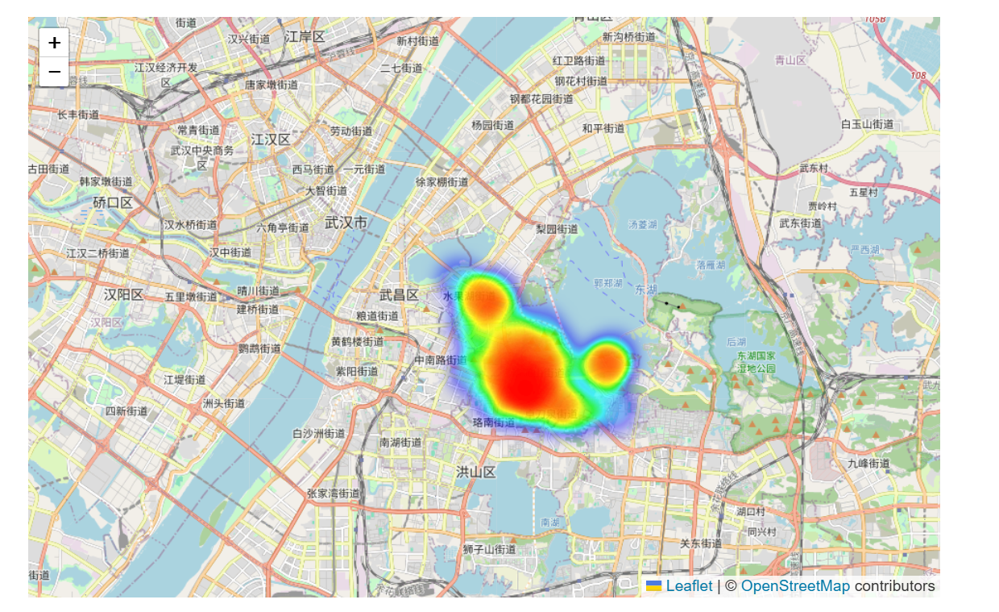
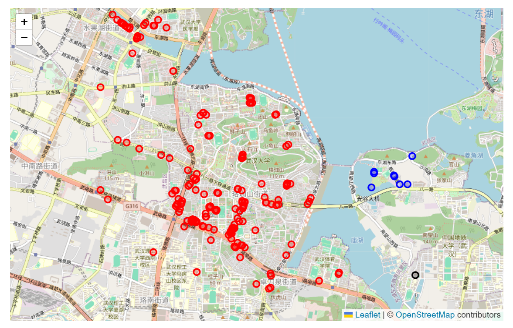
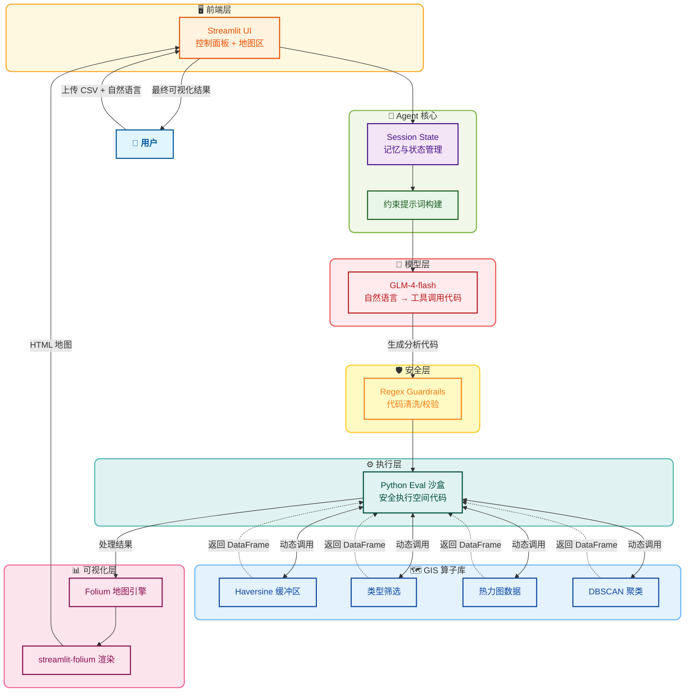

# 🌍 GeoAgent Copilot：AI 空间智能分析工作台

Created time: 2026年5月9日 12:49

---

## ① 项目简介

**GeoAgent Copilot** 是一个基于 `LLM + GIS Tool Calling` 架构的空间智能分析 Agent。

针对非专业测绘人员使用传统 GIS 软件门槛高的痛点，本项目通过大模型意图识别与底层工具链调度，让用户可以直接以**自然语言对话**的方式完成复杂的空间数据挖掘。目前已支持：

- 🔍 **POI 精准检索与过滤**
- ⭕ **空间缓冲区分析 (Buffer Analysis)**
- 🔥 **热点区域密度分析 (Heatmap)**
- 🧠 **空间商业聚类分析 (DBSCAN)**
- 🗺️ **交互式地图动态可视化**

> **🚀 立即体验：[点击这里访问 GeoAgent 网页版](https://geoagent-copilot.streamlit.app/)**
> 

---

## ② 项目截图与演示视频

### 1. 沉浸式左右分栏主界面 (Dashboard)

### 2. Multi-Step Agent 意图拆解与规划 (JSON Planning)

### 3. 空间密度热力图渲染 (Heatmap Visualization)

### 4. 商业空间聚类分析 (DBSCAN Clustering)

---
### 5. 项目完整演示视频

Demo 视频（Bilibili）：
https://www.bilibili.com/video/BV1M75v6SEbG/?share_source=copy_web&vd_source=6ac55e276e464565c6c1a7df7da0806c
⚠️ 如果无法播放，请复制链接到浏览器地址栏打开。

## ③ 技术架构

系统采用了标准的 **Agentic Workflow（智能体工作流）** 单向数据流设计：

---

## ④ 技术栈

- **前端交互与状态管理**：`Streamlit` (结合 Session State 解决组件重载问题)
- **大模型引擎**：`ZhipuAI (GLM-4 Flash)`
- **地图渲染引擎**：`Folium`, `streamlit-folium`
- **空间数据处理**：`Pandas`, `Numpy`
- **空间机器学习算法**：`scikit-learn` (DBSCAN)
- **核心 AI 范式**：`Multi-Step Tool Calling`, `Agentic Workflow`

---

## ⑤ 核心亮点 (Core Highlights)

作为一款 AI Native 的空间数据产品，本项目的核心壁垒不在于简单的 API 调用，而在于**系统级的产品架构设计与工程容错能力**：

1. **从“代码生成”进化为“多步工具调用” (Multi-Step Tool Calling)**
摒弃了危险且不可控的 `eval()` 直接执行代码模式。将 GIS 能力原子化封装为 `Tool Registry`，强制大模型输出结构化的 JSON 步骤计划，实现了“意图解析”与“系统执行”的彻底解耦，极大提升了系统的安全性与可扩展性。
2. **硬核空间算法的平民化赋能**
将需要专业背景才能操作的机器学习算法（如 DBSCAN 空间聚类参数调优、Haversine 球面距离计算）封装在产品底层，用户只需输入“分析商业聚集区”，系统即可自动完成从特征提取到高精度渲染的全闭环。
3. **极其克制的前端状态管理 (Stateful UI)**
针对数据可视化中高频的“地图拖拽导致页面重载闪退”痛点，深入前端框架底层，引入单向渲染锁 (`returned_objects=[]`) 与全局 `Session State` 记忆机制，保障了流畅的商业级 SaaS 交互体验。
4. **双重护栏兜底机制 (Dual Guardrails)**
深知大模型存在“格式幻觉”，在 Prompt 强约束的基础上，在工程执行层引入 Regex 暴力清洗机制，确保 Agent 输出的 JSON Schema 100% 可被后台安全解析。

---

---

## 👤 关于作者

**张林果**

- 🎓 武汉大学 测绘工程专业
- 💻 专注方向：AI 产品经理 / 空间数据分析 (GIS)
- 📧 邮箱：3123309125@qq.com
- 💡 *"永远相信，优秀的产品是在极度克制与解决真实痛点中诞生的。"*
